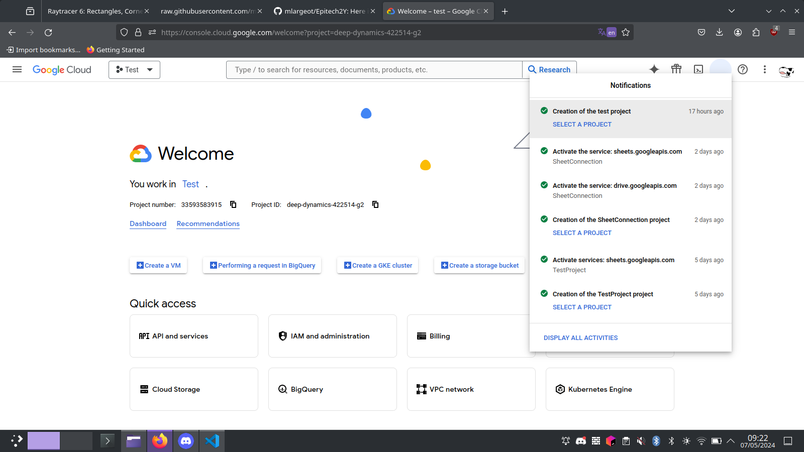

# Project setup

## Google sheet

First of all you need a google account to setup the project.

Once connected to your account you have to create a google sheet: https://docs.google.com/spreadsheets

Name it the way you want.

## Google project & service account

The second step of the project setup will be creation of google project and service account.

To do it, go to: https://console.cloud.google.com

Click on the project tab at the top left corner of the screen (next to the google tab).

Name it the way you want.

