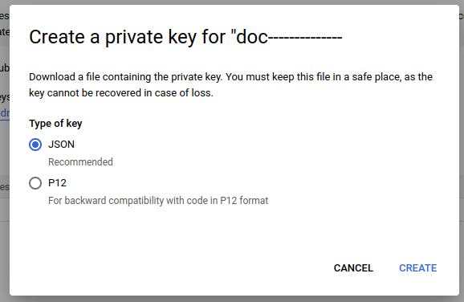

# Project setup

## Google sheet

First of all, you need a Google account to set up the project.

Once connected to your account, you have to create a Google Sheet: https://docs.google.com/spreadsheets

Name it whatever you want.

## Google project & service account

The second step of the project setup will be the creation of a Google project and a service account.

To do this, go to: https://console.cloud.google.com


Click on the project tab at the top left corner of the screen (next to the Google tab).


Name it whatever you want.


Once the project is created, select this project.
Now, in the navigation menu, look for **APIs and services**


Click on ```Enable APIs and services```.
Look for ```Google Drive API``` and ```Google Sheets API```.

Once enabled, you have to create a service account to interact with your Google Sheet.
Go to ```Credentials```:


Then click ```+ Create credentials``` and select ```Service account```:


Name it whatever you want once again.

For the second step of the service account creation, select the ```Editor``` role:


(You can skip the third step)

## Auth key & configuration file...

Now that the service account is created, we need three more things:

- Create an auth key & download the configuration file
- Set the service account as an editor of the Google Sheet

First, go to your service account details and navigate to the ```Key``` section:


Now, create a key and select ```json``` extension:



Once the configuration file is downloaded, you need to place this file into the ```src``` directory of this project. It is recommended to rename this file.

To set the service account as an editor of the Google Sheet, you need to open your configuration file and look for the ```client_email```:


Now, go to your Google Sheet and share it with your service account, granting the account editor rights.

## .env file

The last step to configure this project is to create ```.env``` file at the root of the project directory.


Create these two exact environment variables and fill them with the name of your configuration file and the name of your Google Sheet.


